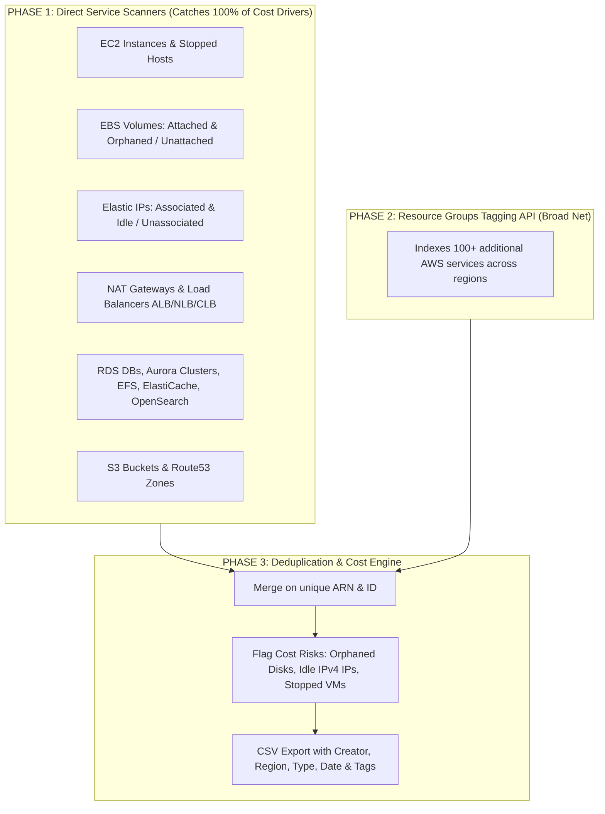

# AWS Cloud Resources Inventory

## Prerequisites
1. Install [`aws` CLI](https://docs.aws.amazon.com/cli/latest/userguide/getting-started-install.html)
2. Have an active AWS account with right permissions

## Authenticate locally in your terminal
```bash
aws sso login
# or ensure AWS CLI credentials/environment variables are set
```

## Run the hybrid inventory tool:
```bash
python3 scripts/aws_inventory_hybrid.py
```

## Optional arguments (e.g. custom regions or custom CSV output name):
```bash
python3 scripts/aws_inventory_hybrid.py --regions us-east-1,us-east-2,us-west-2 --output my_cloud_costs.csv
```

## Sample Result
```bash
% python3 scripts/aws_inventory_hybrid.py
[*] Checking AWS CLI authentication session...
[+] Authenticated successfully!
    Account ID : 1234567890
    Caller ARN : arn:aws:iam::1234567890:user/madhavan@mrlabs.xyz

==============================================================================
PHASE 1: Direct Service-Level Scans (Capturing Tagged & Untagged Cost Drivers)
==============================================================================
[*] Directly scanning S3 Buckets (Global)...
[*] Directly scanning Route53 Hosted Zones (Global)...
[*] Directly scanning region: us-east-1 ...
[*] Directly scanning region: us-east-2 ...
[*] Directly scanning region: us-west-1 ...
[*] Directly scanning region: us-west-2 ...

[+] Direct Scanner completed: 1313 cost/infrastructure items found.

==============================================================================
PHASE 2: Resource Groups Tagging API Scan (Broad Coverage across 100+ Services)
==============================================================================
[*] Querying Tagging API for region: us-east-1 ...
[*] Querying Tagging API for region: us-east-2 ...
[*] Querying Tagging API for region: us-west-1 ...
[*] Querying Tagging API for region: us-west-2 ...
[+] Tagging API completed: 2056 tagged items indexed.

==============================================================================
PHASE 3: Deduplication, Cost Diagnosis & CSV Export
==============================================================================
[+] Unified Total Discovered Resources: 3256
[SUCCESS] Complete inventory written to: aws_cloud_resources_inventory.csv
```

## Approach


---
